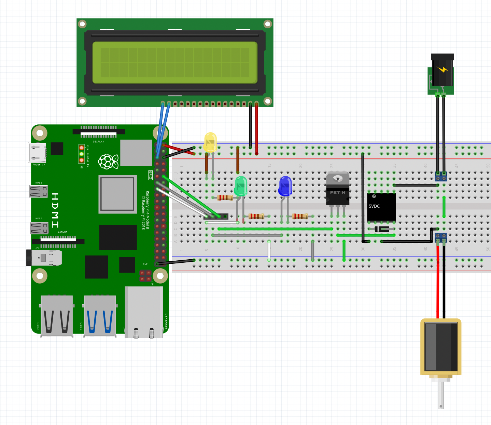

# Poppyland Home
FastAPI server to control an RPi

## Circuit Schematic

- The LCD screen is actually a 24x4 screen and has GND, VCC, SDA, and SCL male header pins already soldered on
- The yellow LED indicates power from the 5V pin.
- The green LED indicates the server is running.
- The blue LED indicates the raincloud valve is open.

## Server Setup

[rpiserver/README.md](https://github.com/hwilloug/poppyland-home/blob/main/rpiserver/README.md)

## LCD Setup

[lcd-control/README.md](https://github.com/hwilloug/poppyland-home/blob/main/lcd-control/README.md)