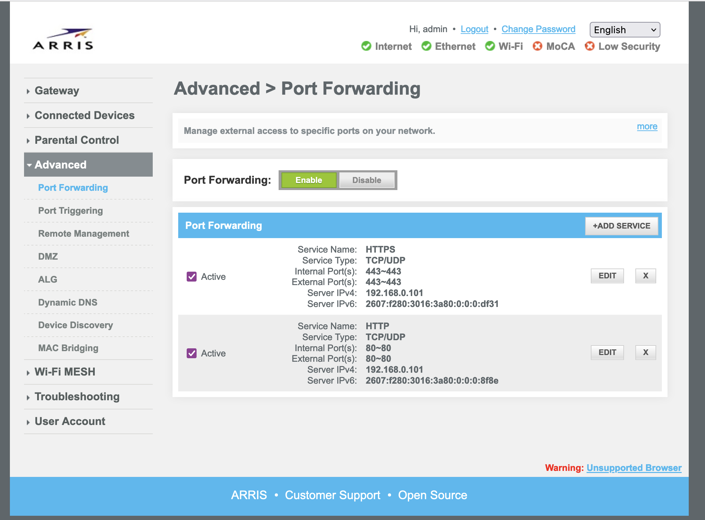

# Poppyland Home RPi Server

## Server Setup

### Overview

The following are the steps to get the server running and proxying HTTPS through nginx for a custom domain:

1. Install python packages
2. Install nginx
3. Configure nginx
4. Configure your router
5. Add record to Route53
6. Get TLS certificate 

#### Required Software

- python3.11
- poetry 

### Install python packages

```
poetry install
```

### Nginx Install and Configuration

[Official Documentation](https://www.nginx.com/resources/wiki/start/topics/tutorials/install/)

```
sudo apt update
sudo apt install nginx
sudo systemctl start nginx
```

Update the server_name in the nginx config to be your domain. In this case, `home.poppyland.dev`.

```
sudo vim /etc/nginx/sites-enabled/default
```

```
upstream apiserver {
   server localhost:8080; 
}

server {
    root /var/www/html;
    
    index index.html index.htm index.nginx-debian.html;
    
    server_name home.poppyland.dev;
    
    location / {
        auth_basic "Administrator's Area";
        auth_basic_user_file /etc/apache2/.htpasswd;
        rewrite ^/home/(.*) /$1 break;
        proxy_set_header Host $http_host;
        proxy_pass http://apiserver
    }
    
    listen [::]:80;
    listen 80;
}
```

```
sudo systemctl restart nginx
```

The server should now be accessable over HTTP.

### Router Configuration

Log into your router's web interface.

1. Request a static IP for your router, if needed.
2. Lock your Raspberry Pi to a static IP.
3. Port foward both HTTP and HTTPS to the Raspberry Pi's static IP.

4. Note your WAN IPv4 address as well as the Raspberry Pi's static IP.

### Route 53 Configuration

Add a record to your hosted zone for the domain that you own.
- An A Record
- Points to your WAN IPv4 address as well as the Raspberry Pi's static IP

### Certbot Configuration

[Official Documentation](https://certbot.eff.org/instructions?ws=nginx&os=debianstretch)

Follow the official documentation, then restart nginx.

```
sudo systemctl restart nginx
```

The server should now be accessable at your domain over HTTPS.

## Running the Server

Run the server using the run script:

```
./run.sh
```

The server should be accessable at `http://localhost:8080` and `home.poppyland.dev`

